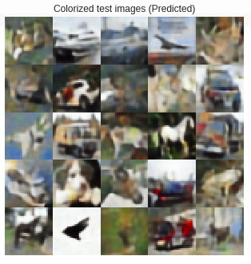
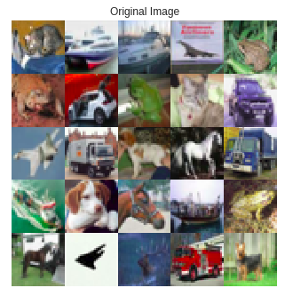

# Automatic Colourisation Autoencoders

## Introduction
This model can ***convert a grayscale image into colour image***. It has been trained on over 50000 images from the CIFAR10 dataset.

## Code Link

> Use Google Colab to run the model

[Code on google colab](https://colab.research.google.com/drive/1K76QtR0m7U_5Er5Vdh7Z4E8MMdt95-y7)

## Dataset

***CIFAR10***

## Instructions
Open the code link and the every cell.

## Output

